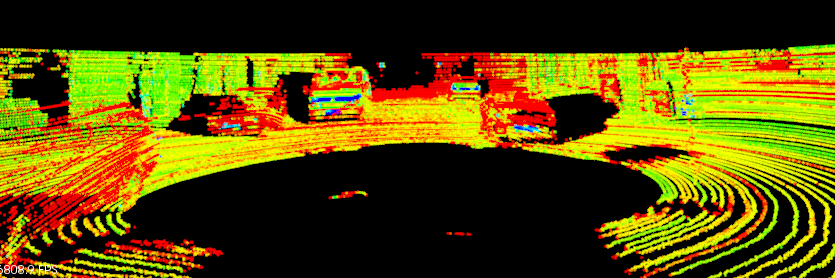

# Simple Lidar Obstacle Detection
Very simple pipeline to detect vehicles in a point cloud data. This project creates 3D bounding boxes to enclose vehicles by implementing 3D RANSAC for segmentation and KD-Tree & Euclidean algorithms for clustering. This repo uses [Udacity's SFND_Lidar_Obstacle_Detection repo](https://github.com/udacity/SFND_Lidar_Obstacle_Detection) as a base template and guide.

<p align="center"> 
  
  
</p>
<p align="center"> Fig: Before and after obstacle detection </p>


## Directory Structure
```
.Simple-Lidar-Obstacle-Detection
├── build.sh                        # Compiles code to create 'a build'
├── run.sh                          # Runs the build
├── CMakeLists.txt                  # Compiler Instructions
├── README_images                   # Images used by README.md
│   └── ...
├── README.md
└── src                             # C++ code
    ├── environment.cpp             # Main File
    ├── processPointClouds.cpp      # Point Cloud Data (PCD) Processing functions
    ├── processPointClouds.h
    ├── quiz                        # Excercises to understand RANSAC and KD-Tree
    │   ├── cluster
    │   │   ├── cluster.cpp
    │   │   ├── CMakeLists.txt
    │   │   └── kdtree.h
    │   └── ransac
    │       ├── CMakeLists.txt
    │       └── ransac2d.cpp
    ├── render
    │   ├── box.h                   # struct definitions for box objects
    │   ├── render.cpp		        # Displays PCD, box, etc
    │   └── render.h
    └── sensors
        ├── data/pcd
        │   ├── data_1              # main real-world dataset
        │   │	  └── ...
        │   ├── data_2              # extra real-world dataset
        │   │	  └── ...
        │   └── simpleHighway.pcd   # Copy of simulated pcd dataset
        └── lidar.h                 # lib for generating simulated pcd
```
## Project
### Dataset
The `environment.cpp` contains two sections:
- simpleHighway: uses simulated Point Cloud Data which is generated on the spot by `lidar.h`
- cityBlock    : uses real-world Point Cloud Data stored at `data/pcd`

### Helper Functions
Processing functions for filtering, segmenting, clustering, boxing, loading, and saving pcd are coded as [function templates](http://www.cplusplus.com/doc/oldtutorial/templates/) to process any type of PCD: PointXYZ, PointXYZI, etc.

- `FilterCloud` Applies Voxel Grid Filtering and extracts Region of Interest.
- `SeparateClouds` Separates an input cloud in two groups given the indeces of first group.
- `SegmentPlane`  Applies RANSAC to fit a plane.
- `Clustering` Associates groups of points by how close together they are using Eucledian clustering.
- `BoundingBox` Sets box coodinates of a point cloud (a cluster) so that it can be rendered.
- `savePcd`, `loadPcd`, `streamPcd` displays additional terminal outputs than plainly using PCL's built-in functions. 
- `initHighway` Creates a virtual highway and cars to later be scanned by a virtual lidar and rendered in a viewer
- `simpleHighway` Main processing pipeline for simulated pcd
- `cityBlock` Main processing pipeline for real-world pcd
- `initCamera` Helps set different viewing angles in your window: XY (45 degree), TopDown, Side, and FPS (First Person Sense).

### Pipeline
<p align="center">  </p>
<p align="center">  Fig: Original PCD </p>

<p align="center">  </p>  
<p align="center"> Fig: Step 1 -> <b>Filter:</b> downsample, choose region of interest, remove rooftop points. Step 2 -> <b>Segment</b> plane from objects using RANSAC. Step 3 -> <b>Cluster</b> objects above plane. Step 4 -> Apply Bounding Boxes. </p>

<p align="center">
  
  
</p>
<p align="center"> Fig: Streaming back multiple pcd files through pipeline </p>

### Additional Notes
- Point cloud data can be very large. By instatinating on the heap, we have more memory to work with than the 2MB on the stack. However, it takes longer to look up objects on the heap, while stack lookup is very fast.

- Navigation in PCL Viewer
    - Zoom: hold the right mouse key and move the mouse forward/backwards, or use your mouse scroller.
    - Pan: Hold down the middle mouse button (the scroller) and move the mouse.
    - Rotate: Hold the left mouse button and move the mouse.

## Drawbacks and improvements
Not all vehicles have the same size so setting a fixed radius distance to search for points for clustering leads to erroneous results. Possible improvements can be tracking detections over the history of frames to create associations between detections. Looking at detections in consecutive frames helps filter and track based on volume and shapes. Using deep neural networks for clustering seems a more flexible and robust approach than manual tuning.

## Installation
Open your terminal and type:
```bash
git clone https://github.com/laygond/Simple-Lidar-Obstacle-Detection.git
```
You will also need the Point Cloud Library (PCL) for this project.
Open your terminal and type:
```bash
sudo apt install libpcl-dev
```
For PCL in Windows and Mac go to the installation section from [here.](https://github.com/udacity/SFND_Lidar_Obstacle_Detection)

## Run Project
In terminal go to your Simple-Lidar-Obstacle-Detection repo and type:
```
./build.sh
./run.sh
```
Note: you might need to `chmod +x build.sh` and `chmod +x run.sh` before executing.

